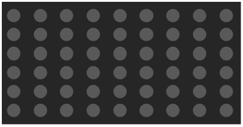

# 詳細仕様書

## 操作方法
- 各キーでキャラクターを動かす(1P)
    - [↑] 上に動く
    - [↓] 下に動く
    - [→] 右に動く
    - [←] 左に動く
    - [M] 回転
   
- 各キーでキャラクターを動かす(2P)
    - [W] 上に動く
    - [S] 下に動く
    - [D] 右に動く
    - [A] 左に動く
    - [Z] 回転

## 操作画面

## 登場キャラクター

- ステージにランダムに10個配置される
- 当たり判定は...
- 食われると消える
- 餌がある程度消えるとまた10こ増える
- 餌を1つ取るごとに10ポイント増加
- 左右の上に互いのスコアを表示
- スコアが高い方の勝ち
